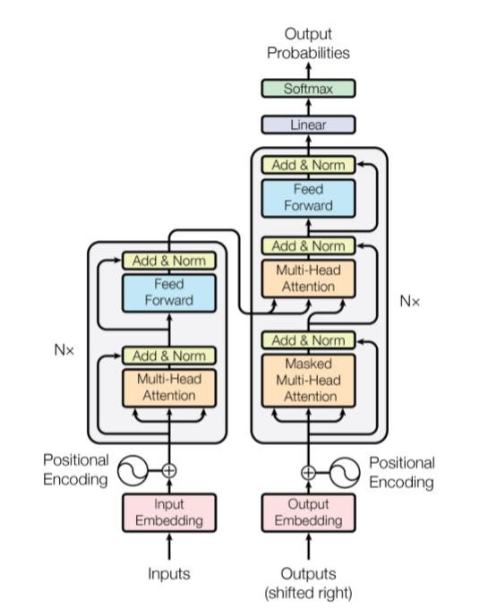

# Transformer: ATTENTION IS ALL YOU NEED
This is an implementation from scratch of the original paper "Attention is all you need"

Paper Reference: https://arxiv.org/abs/1706.03762

Major modules implemented in the code

- Positional Encoder
- Scaled Dot Product Attention
- Multihead Attention
- Layer Norm/Residual Connection
- Encoder
- Decoder
- Masking(Target and Source)

#Acknowledgements:
Credits to the following links as they were very helpful during the course of the experiments:

- [Official Code implementation by Goggle](https://www.tensorflow.org/text/tutorials/transformer#masking)
- [Annotatd Transformer](http://nlp.seas.harvard.edu/2018/04/03/attention.html)
- [Alladin Person(Youtube Tutorial)](https://www.youtube.com/watch?v=U0s0f995w14)
- [Illustrated Transformer](http://jalammar.github.io/illustrated-transformer/)
